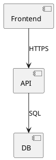

# Workflow: UML-Diagram-Suite in einem neuen Projekt nutzen

Diese Anleitung beschreibt den kompletten Weg vom leeren Projekt-Ordner
bis zum ersten gerenderten Diagramm.

## 0. Voraussetzungen pruefen

Einmalig auf dem Rechner: Java + Graphviz + plantuml.jar + Extensions installieren.

````powershell
cd <suite-root>\setup
.\install-deps.ps1
.\install-extensions.ps1
.\verify-setup.ps1   # muss "Suite ist vollstaendig und funktional" zeigen
````

Details siehe [`../setup/install-deps.md`](../setup/install-deps.md).

## 1. Neues Projekt anlegen

````powershell
$projektName = "mein-projekt"
$projektPfad = "C:\00_Repositories\01_Projekte\$projektName"
New-Item -ItemType Directory -Path $projektPfad -Force
cd $projektPfad

# Optional: Git-Repo
git init
````

## 2. Suite-Konfiguration ins Projekt ziehen

Zwei Dinge werden kopiert: der `.vscode\`-Ordner (Settings + Extensions + Snippets)
und optional die Starter-Diagramme als Ausgangspunkt.

````powershell
$suiteRoot = "C:\00_Repositories\_Set-Ups\_dev\Microsoft.Visual-Studio-Code_IDE\.UML-Diagram_Suite"

# .vscode\ ins Projekt kopieren (PFLICHT)
Copy-Item -Path "$suiteRoot\templates\.vscode" -Destination ".\.vscode" -Recurse

# Starter-Diagramme ins Projekt kopieren (OPTIONAL)
New-Item -ItemType Directory -Path ".\uml" -Force
Copy-Item -Path "$suiteRoot\templates\starter-uml\*" -Destination ".\uml\"
````

## 3. Empfohlene Projekt-Struktur
mein-projekt/
├── .vscode/                  # aus der Suite kopiert
│   ├── extensions.json
│   ├── settings.json
│   └── snippets/
├── docs/                     # Doku, ADRs, Notizen
│   └── README.md
├── uml/                      # alle .puml-Files
│   ├── _shared/              # gemeinsame Includes (Stile, Defs)
│   ├── 01-context.puml
│   ├── 02-domain.puml
│   └── ...
└── out/                      # generierte Diagramme (gitignore!)
└── uml/

## 4. VSCode oeffnen + Extensions akzeptieren

````powershell
code .
````

Beim ersten Oeffnen schlaegt VSCode rechts unten die empfohlenen Extensions vor
(aus `.vscode\extensions.json`). Auf "Install All" klicken, fertig.

## 5. Erstes Diagramm rendern

`uml\01-context.puml` oeffnen, dann `Alt+D` druecken.
Eine Side-by-Side-Preview erscheint und aktualisiert sich live beim Tippen.

## 6. Diagramme exportieren

| Befehl                                   | Ergebnis                                |
|------------------------------------------|-----------------------------------------|
| `Strg+Shift+P` -> "PlantUML: Export Current Diagram"       | Aktuelles Diagramm -> SVG/PNG/PDF       |
| `Strg+Shift+P` -> "PlantUML: Export Workspace Diagrams"    | Alle .puml-Files im Projekt exportieren |

Standard-Output-Format ist SVG (vektoriell, beliebig skalierbar).
Das laesst sich pro Projekt in `.vscode\settings.json` umstellen.

## 7. Doku mit eingebetteten Diagrammen

In `docs\README.md` oder beliebiger anderer .md-Datei:

````markdown
## Architektur


````

Im Markdown-Preview (`Strg+K V`) erscheint das Diagramm dann inline.

## 8. Tastenkombis im Ueberblick

| Shortcut          | Aktion                                     |
|-------------------|--------------------------------------------|
| `Alt+D`           | PlantUML-Preview oeffnen (in .puml-Files)  |
| `Strg+K V`        | Markdown-Preview Side-by-Side              |
| `Strg+Shift+V`    | Markdown-Preview im selben Tab             |
| `Strg+Shift+P`    | Command Palette (alle Befehle)             |
| `uml-class<Tab>`  | Klassendiagramm-Geruest einfuegen          |
| `uml-sequence<Tab>` | Sequenzdiagramm-Geruest einfuegen        |
| `uml-component<Tab>`| Komponentendiagramm-Geruest einfuegen    |
| `uml-activity<Tab>` | Aktivitaetsdiagramm-Geruest einfuegen    |

## 9. .gitignore-Empfehlung

````gitignore
# Generierte Diagramme
out/

# VSCode-User-State (settings.json bleibt versioniert!)
.vscode/.history/
````

## 10. Suite-Update einspielen

Wenn die Suite spaeter Updates bekommt (neue Snippets, geaenderte Settings),
einfach den .vscode\-Ordner neu kopieren:

````powershell
Copy-Item -Path "$suiteRoot\templates\.vscode\*" -Destination ".\.vscode\" -Recurse -Force
````

Eigene Project-Settings darin gehen verloren -- vorher ggf. sichern.
