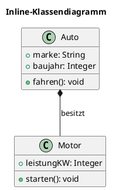
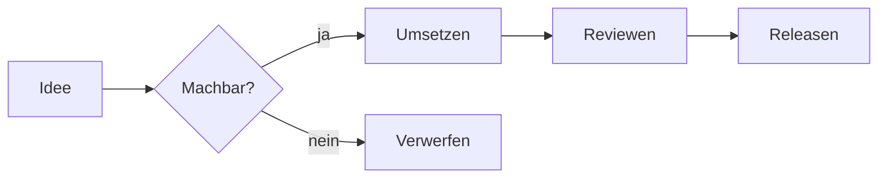
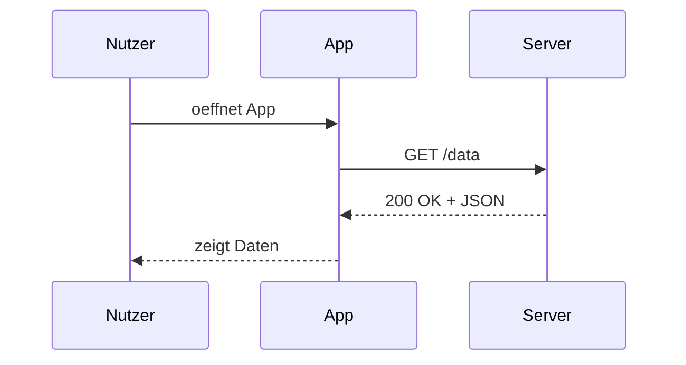

# Beispiel-Projekt mit eingebetteten Diagrammen

> Diese Datei demonstriert den Markdown-Workflow der UML-Diagram-Suite.
> Oeffne sie in VSCode und druecke `Strg+K V` fuer den Side-by-Side-Preview.

## 1. PlantUML inline

Klassendiagramme direkt im Fliesstext - perfekt fuer READMEs und Architektur-Dokumentation.



## 2. Mermaid inline

Mermaid ist leichtgewichtiger und rendert ohne Java-Backend - ideal fuer schnelle Flowcharts.



### Sequenzdiagramm in Mermaid



## 3. Code-Blocks mit Highlighting

```python
def fibonacci(n: int) -> int:
    """Berechnet die n-te Fibonacci-Zahl rekursiv."""
    if n < 2:
        return n
    return fibonacci(n - 1) + fibonacci(n - 2)
```

```powershell
# PowerShell-Beispiel
Get-ChildItem -Recurse -Filter "*.puml" |
    Measure-Object |
    Select-Object Count
```

## 4. Tabellen

| Diagrammtyp | Werkzeug    | Wann verwenden                      |
|-------------|-------------|-------------------------------------|
| Klasse      | PlantUML    | Datenmodelle, Domain-Objekte        |
| Sequenz     | PlantUML    | Detaillierte Interaktionen          |
| Flowchart   | Mermaid     | Schnelle Prozess-Skizzen            |
| C4-Context  | Structurizr | Architektur auf System-Ebene        |
| Freie Form  | Draw.io     | Alles, was strukturiert nicht passt |

## 5. Workflow-Hinweise

1. **PlantUML-Blocks** rendern lokal - benoetigen Java + Graphviz auf dem Rechner.
2. **Mermaid-Blocks** rendern im Browser/Webview - keine Dependencies.
3. **Bilder exportieren**: Rechtsklick im Preview -> "Open in Browser" -> dann speichern.
4. **PDF-Export**: Im Preview oben das Drucker-Icon, oder `Strg+Shift+P` -> "Markdown PDF: Export".

---

*Erstellt mit der UML-Diagram-Suite.*
