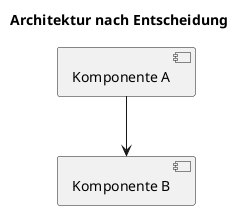

# ADR-0001: Titel der Entscheidung

- **Status:** vorgeschlagen | akzeptiert | ueberholt | abgeloest durch ADR-XXXX
- **Datum:** YYYY-MM-DD
- **Entscheider:** Name(n)

## Kontext

Welches Problem oder welche Frage steht zur Entscheidung?
Was sind die treibenden Kraefte (technisch, fachlich, organisatorisch)?

## Optionen

### Option A: Kurzname
- Vorteile: ...
- Nachteile: ...

### Option B: Kurzname
- Vorteile: ...
- Nachteile: ...

## Entscheidung

Welche Option wurde gewaehlt und warum?

## Konsequenzen

- **Positiv:** ...
- **Negativ:** ...
- **Folge-Entscheidungen:** ...

## Visualisierung (optional)

